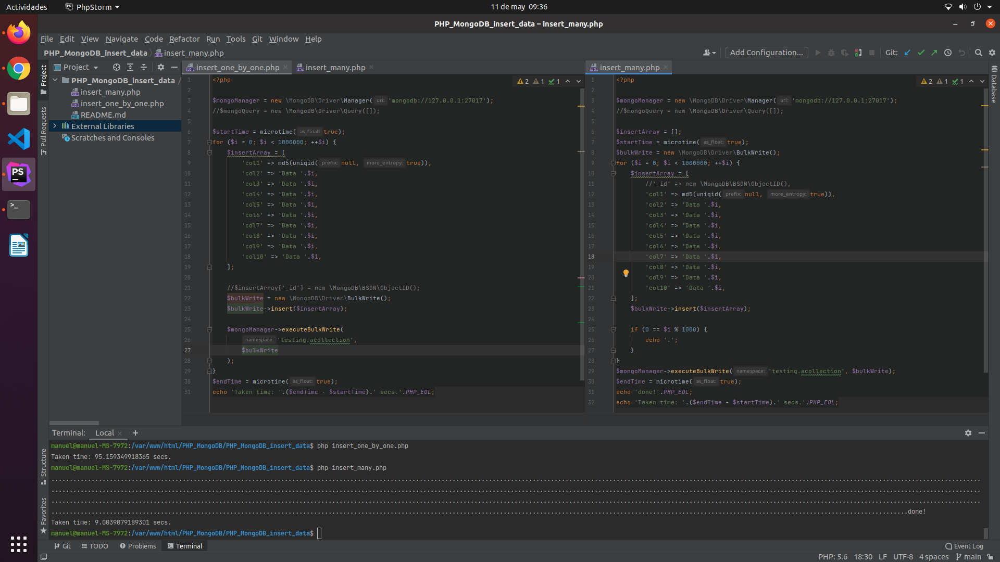

# PHP MongoDB insert data

**I compare the insertion of 1M documents one by one and all together to notice the difference in speed with which the query is resolved. One bulkWrite for each insert or just one for all.**

